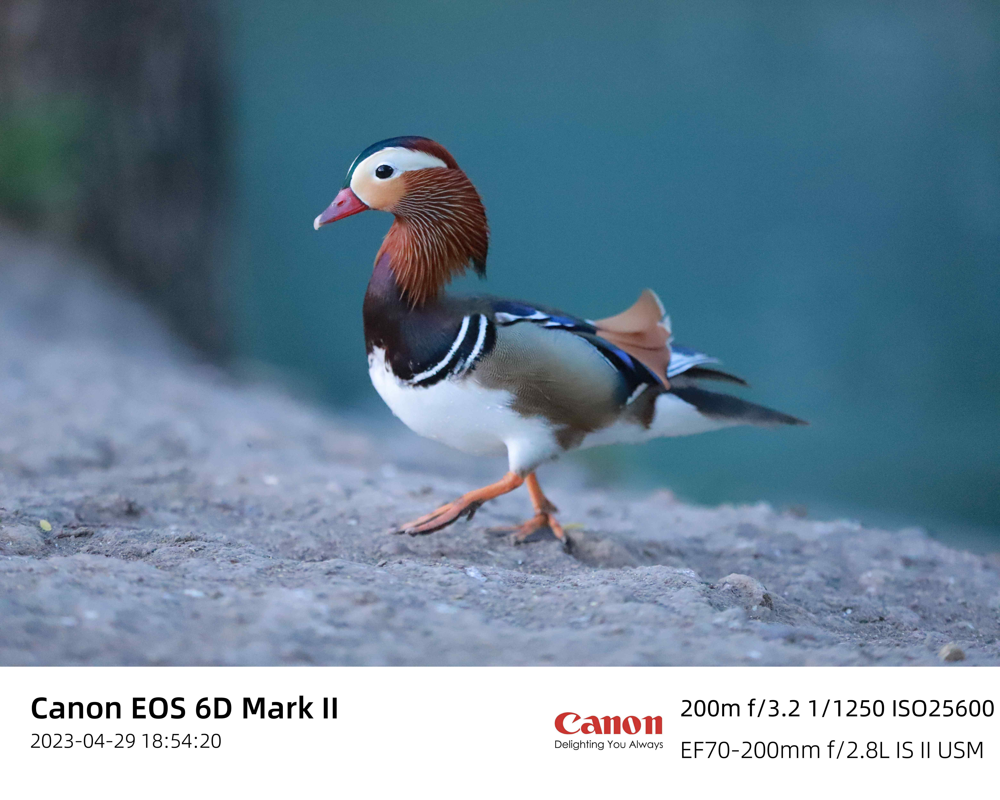
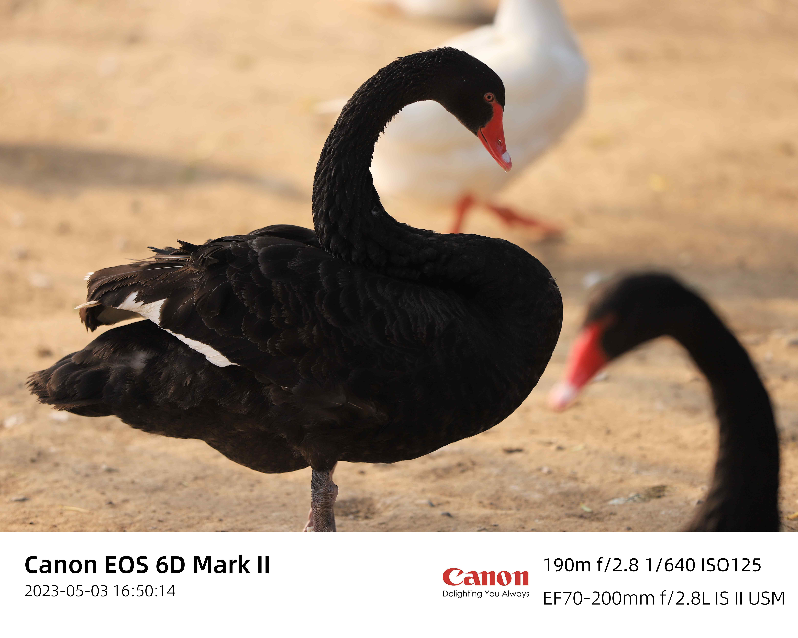
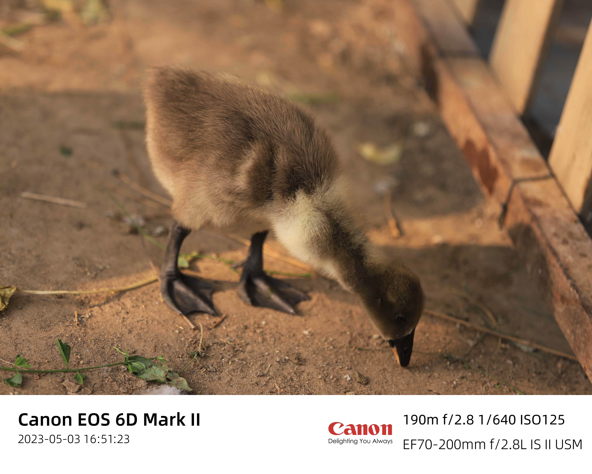
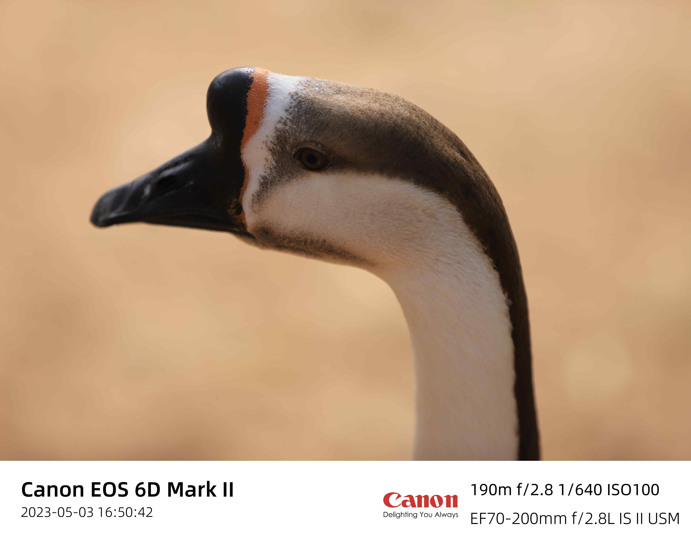

# YourPhotoBorder
> [](https://github.com/sprayman1999/YourPhotoBorder)
> [](https://github.com/sprayman1999/YourPhotoBorder/blob/master/LICENSE)
> 
 - 如果遇到BUG，请及时提交issue，我会尽快处理，感谢🙏
## 简述
我是一名摄影爱好者📷 & 程序员🧑‍💻，在大半夜有感而发，突然想写一个添加相框的自动化程序⚙️，可以给照片带来更进一步的仪式感🎆  
如果我的工具帮助到了您，也可点个star🌟支持我  
## 使用教程
### 环境配置
首先需要安装[Python3](https://www.python.org/downloads/)
```
$ git clone https://github.com/sprayman1999/YourPhotoBorder
$ cd YourPhotoBorder
$ python3 -m pip install --requirement requirements.txt
```

### 命令参数
```
-c : 指定配置文件
-f : 指定输入图片或文件夹
-o : 指定输出位置或文件夹
-sf : 指定引入EXIF的文件夹，导出时会采用该目录同名图片的EXIF
```

### 单图片处理命令
```
$ python3 ./main.py -c ./configs/your_photo_border.json -f ./test/test_photo.jpg -o ./output/output.jpg
```
### 批量图片处理命令
```
$ python3 ./main.py -c ./configs/your_photo_border.json -f ./test/ -o ./output/
[*] PhotoPath: ./test/fuzi//output3.jpg OutputPath: ./output//output3.jpg       ExifSourcePath: None/output3.jpg
[*] PhotoPath: ./test/fuzi//output1.jpg OutputPath: ./output//output1.jpg       ExifSourcePath: None/output1.jpg
[*] PhotoPath: ./test/fuzi//output5.jpg OutputPath: ./output//output5.jpg       ExifSourcePath: None/output5.jpg
[*] PhotoPath: ./test/fuzi//output4.jpg OutputPath: ./output//output4.jpg       ExifSourcePath: None/output4.jpg
[*] PhotoPath: ./test/fuzi//output6.jpg OutputPath: ./output//output6.jpg       ExifSourcePath: None/output6.jpg
[*] PhotoPath: ./test/fuzi//output7.jpg OutputPath: ./output//output7.jpg       ExifSourcePath: None/output7.jpg
[*] PhotoPath: ./test/fuzi//output9.jpg OutputPath: ./output//output9.jpg       ExifSourcePath: None/output9.jpg
[*] PhotoPath: ./test/fuzi//output8.jpg OutputPath: ./output//output8.jpg       ExifSourcePath: None/output8.jpg
[*] PhotoPath: ./test/fuzi//output2.jpg.JPG     OutputPath: ./output//output2.jpg.JPG   ExifSourcePath: None/output2.jpg.JPG
[*] All task is finished!
```
### 样图如下
以下照片一部分来自我个人在西湖拍摄，另一部分来自北京一位朋友日常拍摄，用该程序加上相框之后效果如下
||||
|-|-|-|
||||
||||
||||


## Config文件
### 列表(不定时更新)
 - canon.json
 - default.json
 - nikon_1930s.json
 - nikon_1949.json
 - canon_rotated.json
 - fujifilm.json
 - fujifilm_rotated.json
 - hasselblad.json
 - leica.json
 - sony.json

### Label内容转译
如果Label Content字段存在如下内容时，该内容数据将会被自动替换
```
"${CAMERA_MODEL}":            相机名称
"${PHOTO_ORIGINAL_DATETIME}": 拍摄时间
"${CAMERA_ISO}":              照片ISO
"${APERTURE}":                相机光圈
"${EXPOSURE_TIME}":           相机曝光时间
"${FOCAL_LENGTH}":            镜头当前焦段
"${CAMERA_LENS_MODEL}":       相机镜头名称
```

### Default Config
<details>
<summary>点击展开</summary>

```json
{
    "output_quality": 75,# 导出图片质量
    "config_name": "NIKON",
    "border_size": 0, # 边框粗细
    "background": [255,255,255], # 背景颜色
    "extra_length": "20%", # 将原有照片的长或宽进行拓展，也可以设置成整数
    "camera_args_direction": "down", # 相机参数显示在图片下方
    "original_time_format": "%Y:%m:%d %H:%M:%S", # 照片被拍时的时间格式
    "target_time_format": "%Y-%m-%d %H:%M:%S", # 指定时间格式
    "labels": [ # 可以添加自定义文字
        {
            "label_name": "camera model label", # label名称，无用途，只用于区分
            "font_path": "./fonts/AlibabaPuHuiTi-3-75-SemiBold/AlibabaPuHuiTi-3-75-SemiBold.ttf", # 字体路径
            "font_size": "4.5%", # 字体大小 = 图片高度 * 百分比
            "content": "${CAMERA_MODEL}", # 文字内容
            "position_offset": ["3%","5%"], # 文字的相对坐标，也可以设置成整数
            "font_color": [0,0,0] # 字体颜色
        },
        {
            "label_name": "photo original datetime",
            "font_path": "./fonts/AlibabaPuHuiTi-3-45-Light/AlibabaPuHuiTi-3-45-Light.ttf",
            "font_size": "2.5%",
            "content": "${PHOTO_ORIGINAL_DATETIME}",
            "position_offset": ["3%","10%"],
            "font_color": [0,0,0]
        },
        {
            "label_name": "camera iso",
            "font_path": "./fonts/AlibabaPuHuiTi-3-55-Regular/AlibabaPuHuiTi-3-55-Regular.ttf",
            "font_size": "3.8%",
            "content": "${FOCAL_LENGTH}m f/${APERTURE} ${EXPOSURE_TIME} ISO${CAMERA_ISO}",
            "position_offset": ["68%","3.75%"],
            "font_color": [0,0,0]
        },
        {
            "label_name": "camera lens model",
            "font_path": "./fonts/AlibabaPuHuiTi-3-45-Light/AlibabaPuHuiTi-3-45-Light.ttf",
            "font_size": "3.5%",
            "content": "${CAMERA_LENS_MODEL}",
            "position_offset": ["68%","10%"],
            "font_color": [0,0,0]
        }
    ],
    # 可以添加自定义图片
    "photos": [
        {
            "path": "./assets/camera_logos/NIKON/logo.png", # 图片路径
            "position_offset": ["55%","0%"], # 图片偏移
            "scale": "65%" # 图片缩放
        }
    ]
}
```

</details>

## 已完成开发
 - JPEG解析器
 - 绘图代码核心
 - 配置文件初步确定
 - 输出简单的样例
 - 多进程处理图片
 - 批量导入导出图片

## 未来计划 TODO
 - 完善config格式
 - 完善各类相机厂家的logo数据
 - 相机厂家logo可被裁切成各种形状，比如圆形
 - 支持PNG导入；支持PNG、BMP导出
 - 支持GUI拖动组件，并最后导出配置文件
 - 图片渲染可能存在乱序，需要设定level来限制渲染顺序
 - 背景可设置成图片
 - 手机照片目前还不支持


## BUG
 - sRGB JPEG导出后和原图相比，暗部会偏白

